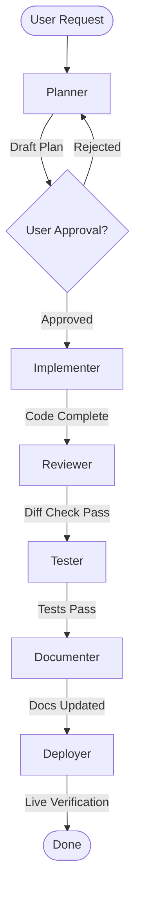

# Agents.md — Multi-Agent Coordination Guidelines

This document defines the agent roles, coordination workflow, and handoff boundaries to prevent overlap, ensure architecture safety, and enforce terminal compression disciplines.

---

## 1. Agent Roles & Responsibilities

| Role | Core Responsibility | Terminal Compression Rule | Handoff Trigger |
|---|---|---|---|
| **Planner** | - Analyzes requirements. - Evaluates architectural impact. - Writes/updates `implementation_plan.md`. | - Reads file trees and status via `rtk` commands. | - Once the user explicitly approves the implementation plan. |
| **Implementer** | - Modifies source code files. - Executes clean, safe implementations. | - Checks linting or compilation via `rtk` logs. | - Once changes are complete and pass initial local checks. |
| **Reviewer** | - Performs static analysis and code diff review. - Checks compliance with standards (no AI attribution, etc.). | - Reviews git diffs using `rtk git diff`. | - If code passes compliance and architectural safety guidelines. |
| **Tester** | - Runs test suites (unit/integration/E2E). - Assesses deployment risk. - Verifies rollback pathways. | - Reads test suites using `rtk` test runners. - Escalates to raw trace only on failure. | - Once all verification tests pass. |
| **Documenter** | - Updates documentation (`Memory.md`, `readmeai/decision-log.md`, etc.). - Keeps maps and indices synchronized. | - Audits changed file scopes via `rtk git status`. | - Once all documentation updates are saved. |
| **Deployer** | - Performs VPS updates (pulling code, reloading Nginx, checking ports). - Ensures no cross-app impacts. | - Inspects service health via `rtk` service checks. | - Once the system is verified live and stable. |

---

## 2. Coordination Workflow & Handoffs

---

## 3. Strict Rules & Escalation Boundaries

### A. Ask-User & Pause Rules
- **Pause & Escalate:** If any change affects database schemas, shared Nginx upstream configs, shared Docker networks, or ports used by other VPS co-tenants, the Planner **MUST** pause the workflow and seek explicit user confirmation.
- **Handoff Blockers:** An agent cannot hand over the task if there are warnings or unresolved issues in the current phase.

### B. Terminal Output and Logs Policy
- Every role **MUST** default to compressed summaries.
- A Reviewer or Tester may escalate and request raw logs **only** if the summary lacks crucial failure context or stack trace data required for debugging.
- The Documenter **MUST** update `RTK.md` if the team adopts new terminal compression utilities or modifies CLI options.
